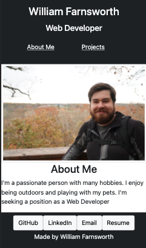
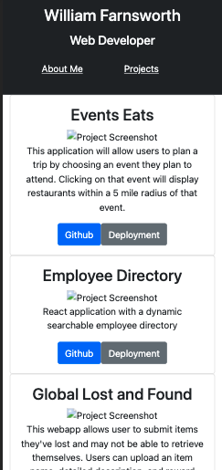

# Development Portfolio

## Description

Personal portfolio Website. In future i'd like to get the project screenshots working and change the styling more so it doesn't look so generic.

## Built With

* [react](https://reactjs.org/)

* [javascript](https://www.javascript.com/)

* [Bootstrap](https://getbootstrap.com/docs/5.0/getting-started/introduction/)

*[npm](https://www.npmjs.com/)

## Usage Instructions

    Click the GitHub pages link to open the deployed website.

## Contributers

William Farnsworth - [Github](https://github.com/Cynwise)
